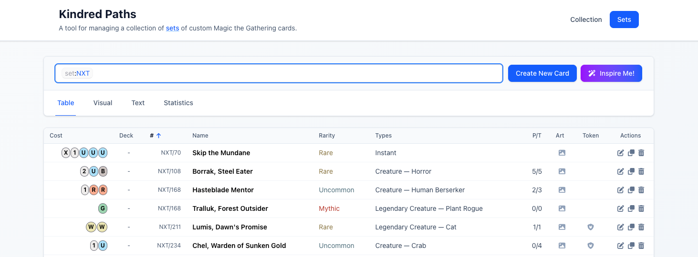

# Kindred Paths
A tool for managing a collection of custom Magic the Gathering cards. Created by [Simon Karman](https://simonkarman.nl).

## Features
- **Card Management**: Add, edit, and delete Magic the Gathering cards from your collection.
- **View Rendered Cards**: View rendered Magic the Gathering cards in your collection with details like name, type, mana cost, artwork, and more.
- **Card AI Suggestions**: Get AI-generated text suggestions for things such as card names (via Anthropic).
- **Card AI Artwork**: Get AI-generated suggestions for card artwork (via LeonardoAI).
- **Deck Management**: Create and manage decks using the cards in your collection.
- **Printing**: Create a printable PDF of cards on A4 format suitable for easy cut out for play testing purposes.



## Prerequisites
Make sure you have the following tools installed on your system:
- **Git** — should be available by default, otherwise recommended to install from [git-scm](https://git-scm.com/downloads).
- **Node.js and npm** — Recommended to install from [nvm](https://github.com/nvm-sh/nvm) to install: `nvm install --lts` and `nvm use --lts`.
- **Docker** — Recommend to install [Docker Desktop](https://docs.docker.com/desktop/).
- Make sure no other applications are running on port `4100`, `4101`, or `4102`.

> Note: If you want to use AI suggestions, you will also need an API key for [Anthropic](https://www.anthropic.com/) and/or [Leonardo AI](https://leonardo.ai/). These require a paid subscription.

## Getting Started
You can start the server and client in development mode. Run these commands in your terminal in the **root directory** of the repository:

```bash
# (optional) Set the environment variables if you want to use AI suggestions
export ANTHROPIC_API_KEY="..."
export LEONARDO_API_KEY="..."

# Make sure you have Docker running...
docker ps

# Install and start the application (port 4100)
npm install
npm run dev
```

You can now open the application in your browser on https://localhost:4100.

> The server is available on `http://localhost:4101` and Card Conjurer is available on `http://localhost:4102`.

## Troubleshooting
If you run into issues, here are some common troubleshooting steps:

### Cannot connect to the Docker daemon
You can get this error when trying to run the application and Docker is not running or not properly configured.

> Error: `"Cannot connect to the Docker daemon at unix:///Users/username/.docker/run/docker.sock. Is the docker daemon running?"`

This error indicates that Docker is not running on your system. Make sure you have Docker Desktop running and try again.

### Could not resolve authentication
You can get this error when trying to request card name suggestions or card art setting or other text suggestion from Antropic.

> Error `"Error: Could not resolve authentication method. Expected either apiKey or authToken to be set. Or for one of the "X-Api-Key" or "Authorization" headers to be explicitly omitted"?`

This means that you have not set the environment variables for the Anthropic. Make sure you have set the `ANTHROPIC_API_KEY` environment variable in your terminal before starting the application. You can find [your keys in the Anthropic console](https://console.anthropic.com/settings/keys).

### Authentication hook unauthorized
You can get this error when trying to request art suggestions from Leonardo AI.

> Error: `"SDKError: Unexpected API response status or content-type: Status 401 Content-Type application/json; charset=utf-8 Body
{"error":"Authentication hook unauthorized this request","path":"$","code":"access-denied"}"`

This means that you have not set the environment variables for the Leonardo AI. Make sure you have set the `LEONARDO_API_KEY` environment variable in your terminal before starting the application. You can find [your keys in the Leonardo AI console](https://app.leonardo.ai/api-access).
